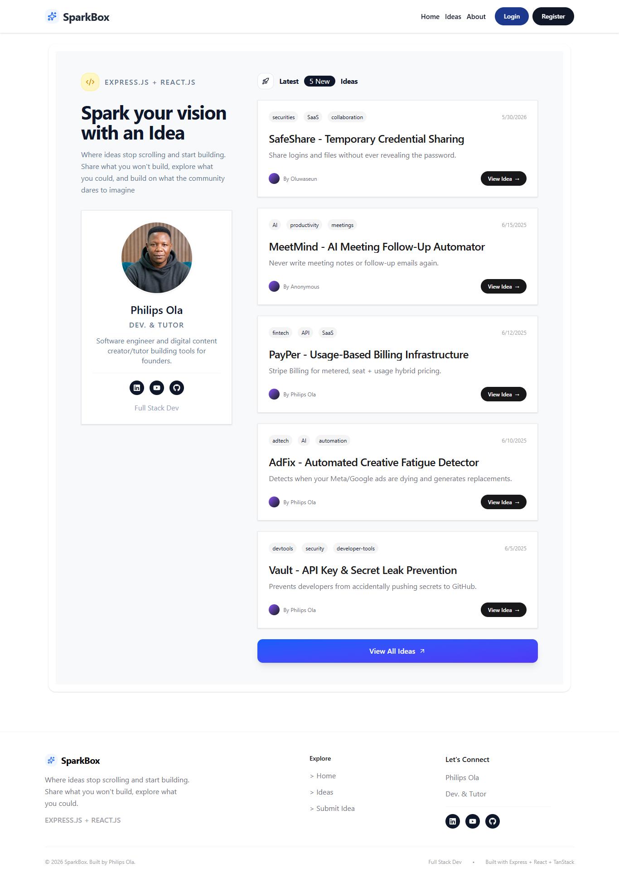
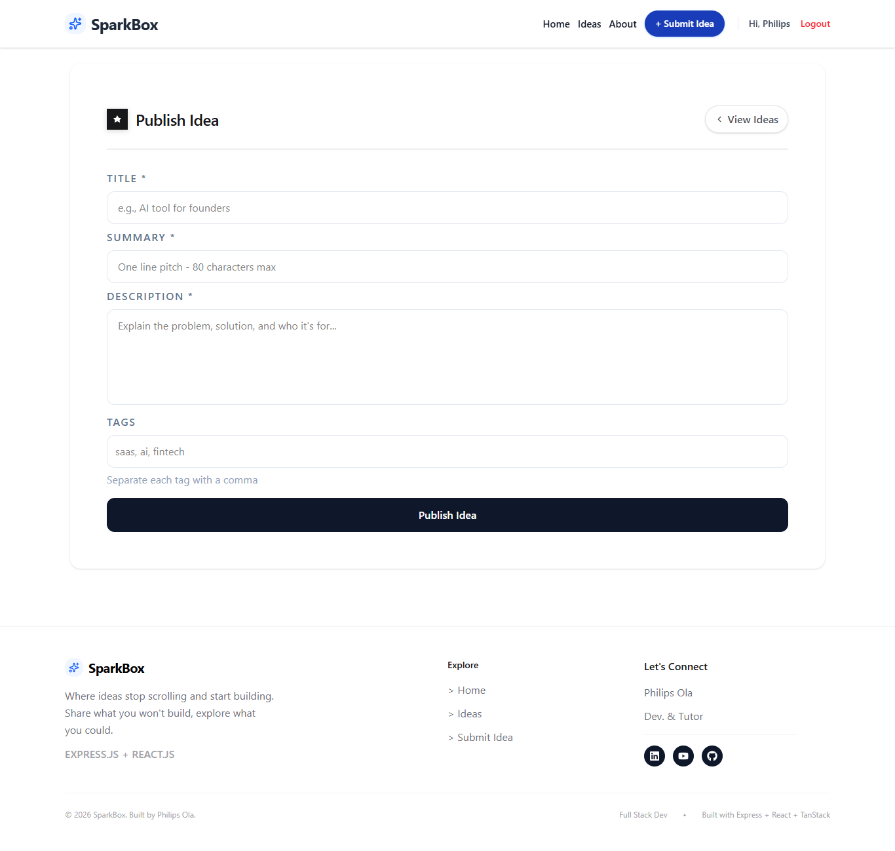
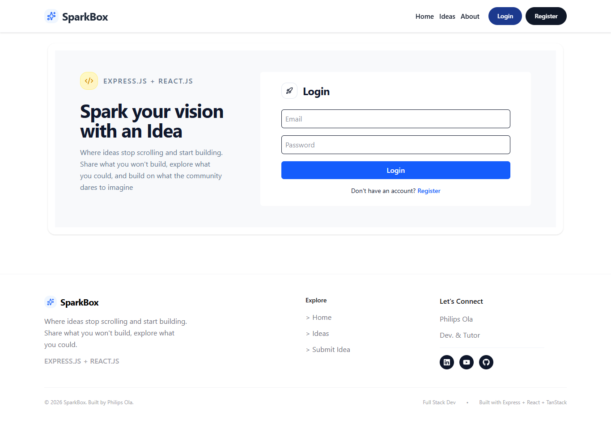
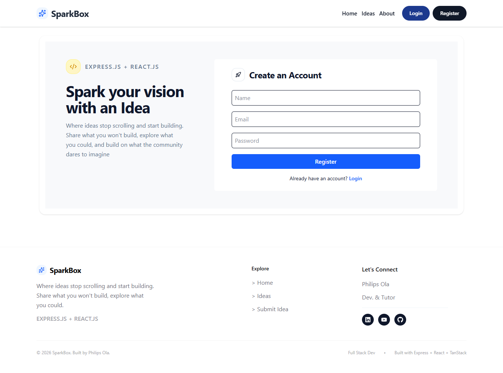

# About the Project

Spark Box is a modern idea-sharing platform built for developers and tech enthusiasts who want to capture, organize, and publish ideas quickly. The app gives users a clean experience for writing project concepts, tagging them for discoverability, and managing their own ideas from a single dashboard. It is designed as both a portfolio project and a practical example of how to build a small, content-driven application with modern frontend tooling.

Spark your vision with an idea.

The platform is intentionally simple, but it demonstrates important engineering patterns such as authentication, protected routes, component reuse, API-driven data fetching, and user-focused interactions. It is a strong study project for understanding how a real-world product can be structured in React with a focus on clarity, maintainability, and user experience.

Live demo: https://spark-boxs.vercel.app/

GitHub repository: https://github.com/philips-ola/spark-box-ui

## Project Overview

- Idea publishing and detail views for developers and tech fans.
- User authentication flow with login, registration, and refresh-token handling.
- Protected author actions for editing and deleting ideas.
- Data fetching and caching with TanStack Query for smooth UI updates.
- Route-based navigation with TanStack Router for a multi-page app feel.
- Clean styling and responsive layout using Tailwind CSS.

## Why This Project Is Useful for Study

- React state management with hooks and context.
- API-driven UI patterns using Axios and query caching.
- Reusable component design for cards, forms, and page layouts.
- Route-based navigation and nested route patterns.
- Auth flow implementation, including protected access and session refresh.
- Form handling, validation thinking, and user feedback states.
- TypeScript usage for safer, clearer frontend code.
- Modern frontend architecture using Vite and Tailwind.

## Features

### 1. Idea Publishing
This feature enables users to create and share ideas with a title, summary, description, and tags. It helps learners understand how structured content is captured and displayed in a real product.

- Form-based idea creation with clear user inputs.
- Tag support for categorizing ideas.
- Clean idea card display for browsing content.
- Publish-ready layout for a portfolio or MVP project.

### 2. Author Controls
Author controls allow the idea owner to manage the content they created without exposing destructive actions to everyone else. This is a common pattern in real apps and a good example of access control logic.

- Edit links shown only to the owner.
- Delete button protected behind a confirmation flow.
- Owner-only UI logic based on user identity.
- Real-world permission pattern for content management.

### 3. Idea Discovery and Reading
Users can browse ideas, view details, and read the full story behind a concept. This section demonstrates how a product transitions from a list view to a detail page while preserving context.

- Listing page for browsing multiple ideas.
- Detail page for a single idea with metadata.
- Publishing author and timestamp information.
- Smooth navigation between content views.

## Screenshots

### Landing Page


### All Idea Page


### Detail Page


### Edit Idea Page


### Add Idea Page


### Login Page


### Registration Page


### About Me


## Tech Stack

- React 19
- Vite
- TypeScript
- Tailwind CSS
- TanStack Router
- TanStack Query
- Axios
- JSON Server (mock/local API support)
- Lucide React icons

## Project Structure

```text
spark-box-ui/
├─ .env
├─ .gitignore
├─ .tanstack/
├─ index.html
├─ package.json
├─ package-lock.json
├─ tsconfig.json
├─ tsr.config.json
├─ vercel.json
├─ vite.config.ts
├─ public/
│  └─ screenshots/
├─ src/
│  ├─ api/
│  │  ├─ auth.ts
│  │  └─ ideas.ts
│  ├─ component/
│  │  ├─ Header.tsx
│  │  ├─ IdeaCard.tsx
│  │  └─ ...
│  ├─ context/
│  │  └─ AuthContext.tsx
│  ├─ data/
│  │  └─ db.json
│  ├─ lib/
│  │  ├─ axios.ts
│  │  └─ authToken.ts
│  ├─ routes/
│  │  ├─ __root.tsx
│  │  ├─ ideas/
│  │  ├─ (auth)/
│  │  └─ ...
│  ├─ styles.css
│  ├─ types.ts
│  ├─ main.tsx
│  ├─ router.tsx
│  └─ routeTree.gen.ts
├─ README.md
└─ node_modules/
```

## How the App Works

### App Startup
When the app boots, Vite loads the React entry file and mounts the router. The app sets up the auth provider, which loads stored authentication state and exposes user details across the application.

### Global Data Fetch
The app uses TanStack Query to fetch idea data and cache responses. Instead of manually managing loading and refresh state for every page, the data layer handles request lifecycle, invalidation, and UI consistency.

### Component Responsibilities
The UI is broken into reusable components such as the idea cards, headers, forms, and route pages. This keeps the app easier to reason about and makes it simple to extend with more features later.

### Auth Flow
Users register or log in through the auth pages. After a successful request, the frontend stores tokens and user data in context, then uses that state to decide whether to display edit and delete controls for an idea.

## API Usage

This project uses an API layer built around Axios to communicate with the Spark Box backend and local mock data. The API calls are centralized in the `src/api` folder, keeping the UI code cleaner.

Example endpoints and usage:

```ts
// Fetch all ideas
const res = await api.get('/ideas');

// Fetch a single idea by id
const res = await api.get(`/ideas/${ideaId}`);

// Create a new idea
const res = await api.post('/ideas', payload);

// Update an idea
const res = await api.patch(`/ideas/${ideaId}`, payload);

// Delete an idea
await api.delete(`/ideas/${ideaId}`);
```

```ts
// Register user
const res = await api.post('/auth/register', {
  name,
  email,
  password,
});

// Login user
const res = await api.post('/auth/login', {
  email,
  password,
});

// Refresh access token
const res = await api.post('/auth/refresh');
```

These requests are useful for learning how frontend code can stay thin while the API handles data persistence and user management.

## Running the Project Locally

### 1. Install
```bash
npm install
```

### 2. Start dev server
```bash
npm run dev
```

### 3. Build
```bash
npm run build
```

### 4. Preview
```bash
npm run preview
```

If you want to run the local mock API for development, you can also use:

```bash
npm run json-server
```

## Environment Variables

Create a `.env` file in the project root and add values similar to:

```env
VITE_API_URL=http://localhost:8000
VITE_APP_NAME=Spark Box
```

If your backend is hosted remotely, replace the URL with the production API endpoint instead of the local value.

## Notes for Study

- Keep API logic separated from UI logic to make refactoring easier.
- Use query caching wisely for better user experience and fewer unnecessary requests.
- Protect author-only actions using explicit user identity comparisons.
- Structure the app by feature so it grows without becoming difficult to maintain.
- Practice reading the data flow from route -> component -> API -> response state.

## License

This project is for educational and portfolio use.

## Developer Detail

- Name: Philips Ola
- Role: Full-Stack Developer
- Portfolio: https://olaphilips.com.ng
- YouTube: https://youtube.com/@idtechnol
- LinkedIn: https://linkedin.com/in/olaphilips/

## Summary

Spark Box is a practical frontend project that combines idea publishing, auth flow, routing, and data fetching into one cohesive application. It is designed to help learners understand how modern React apps are structured while building something useful, portfolio-ready, and easy to explain.
